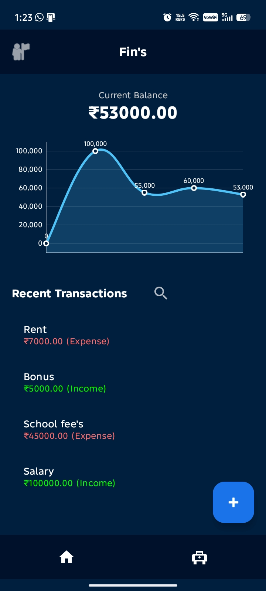
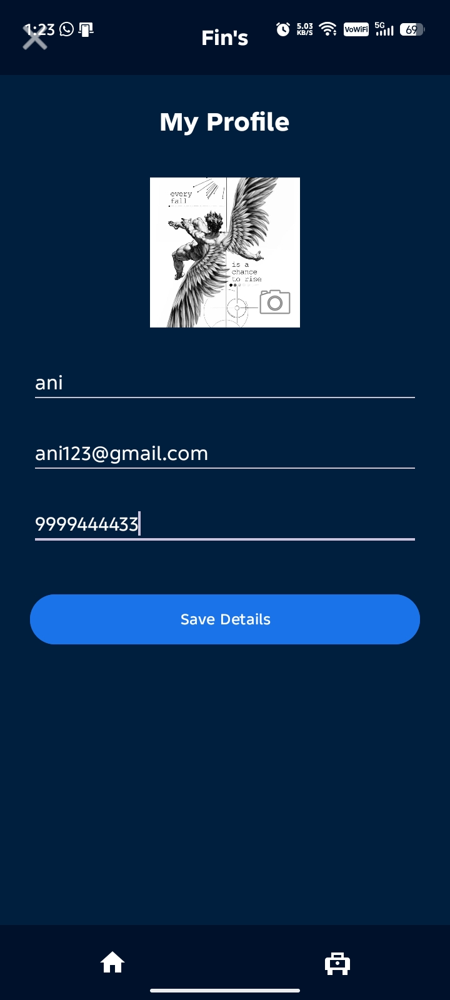
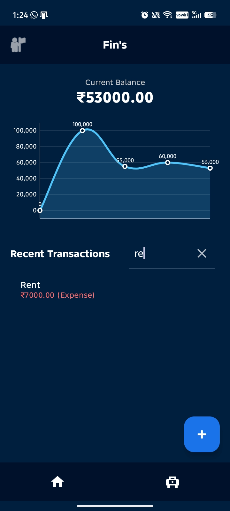
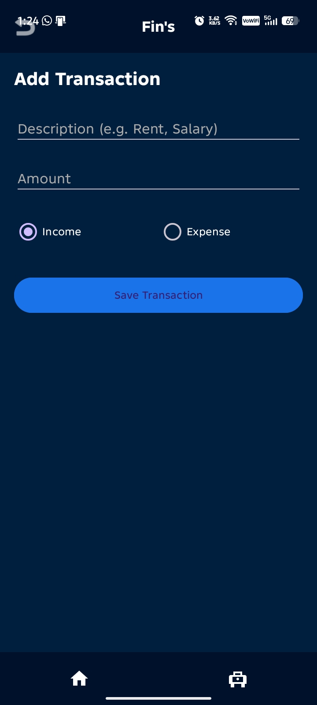
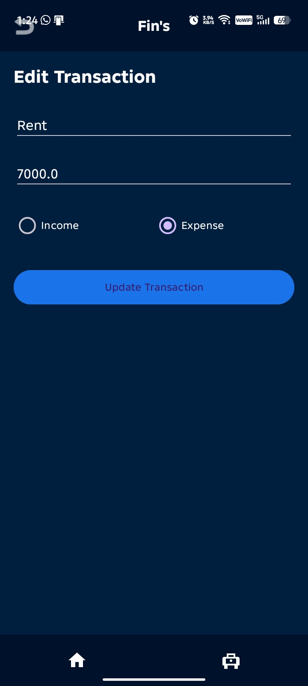
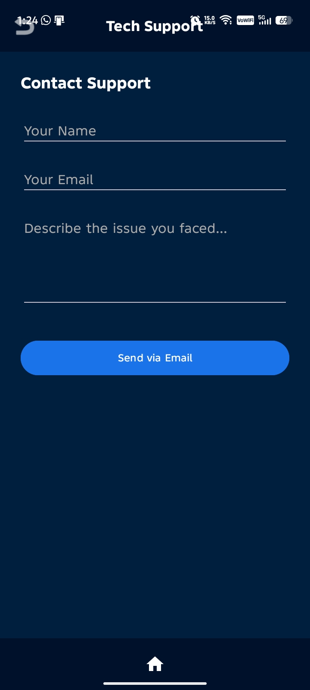

Expense Tracker - Android Application

A comprehensive Personal Finance Management application built for Android. This app allows users to track their daily income and expenses, visualize financial health through interactive charts, and manage a personalized user profile.

Features
- Dashboard Overview:** Real-time balance calculation and status updates (Healthy vs. Overspending).
- Interactive Data Visualization:** A Bar Chart representing Income vs. Expense flow using two-color coding (Green/Red).
- Transaction History:** A dedicated activity to view, scroll, and manage all past financial records.
- User Profile:** Personalized settings to save name, email, contact number, and a profile photo using internal storage.
- Persistent Storage:** Uses SQLite Database to ensure data is saved locally and remains available after app restarts.

Tech Stack
- Language:** Java
- IDE:** Android Studio
- Database:** SQLite
- UI Design:** XML (ConstraintLayout, Material Design)
- Library:** [MPAndroidChart](https://github.com/PhilJay/MPAndroidChart) (for data visualization)
- Data Persistence:** SharedPreferences (for user profile)

  
  
  
  
  
  
  

